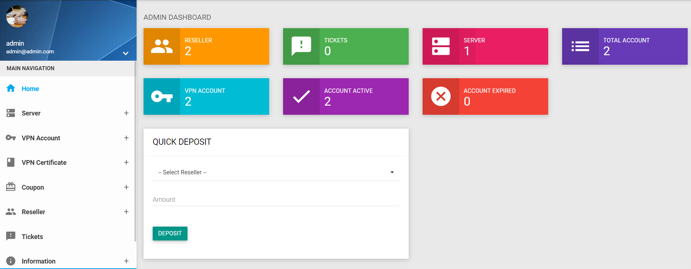

## Features

- Any openvpn backend support
- Easy user management 
- Reseller addon
- User Expire date 
- Easy install with docker 

## PANEL-OVPN
### system update
```
apt update && apt upgrade - y
```

### Install docker 
```
apt install docker.io
```
### Install docker-compose 

```
apt install docker-compose 
```
### clone the repo to vps 
```
git clone <repo>
```
### Go to project directory and run docker image
```
cd Openvpn-Reseller
```
```
docker-compose up -d 
```


### sample  docker-compose image
```
version: '3'

services:
  ui:
    image: lahiru98s/openvpn-panel:1.0
    ports:
      - 8080:80
          

  db:
    image: mariadb:10.6
    restart: always
    ports:
      - 3306:3306
    environment:
      MYSQL_ROOT_PASSWORD: lahiru1998 #do not chnage inform me if you need to chnage passowrd 
      MYSQL_DATABASE: vpn
    volumes:
       - ./database.sql:/docker-entrypoint-initdb.d/database.sql

  phpmyadmin:
    image: phpmyadmin
    restart: always
    ports:
      - 8090:80
    environment:
      - PMA_ARBITRARY=1
```


### Node system monitor Backend ( clone it to root directory )
#### design for ubuntu if you use with cent os ask me to modify it 
```
git clone https://github.com/lahirubro123/helpers.git

chmod +x install.sh
./install.sh
```

## Screenshots




## Authors

- [@nooblk98](https://www.fiverr.com/nooblk98)

